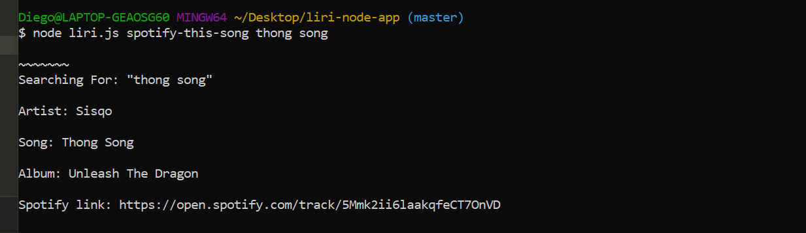

# Liri Node.js

## Description
    For class, we were tasked to make a Siri knockoff and call it Liri, which stands for, *Language Interpreation and Recognition Interface*. Liri will be in charge of 3 things:
        -Searching for movies :clapper:
        -Searching for bands in nearby towns :guitar:
        -Searching for music through Spotify :headphones:

## What's going on?

Objective | Type in Terminal
------  | -------
List bands in town | node liri.js concert-this <band>
Display Spotify song | node liri.js spotify-this-song <song title>
Display movie info | node liri.js movie-this <title>
Display txt file   | node liri.js do-what-it-says

## Spotify
If everything worked as intended, you should see the following:
<<<<<<< HEAD

=======

## Bands

## Movies

## Do it
This will display a txt.file that already has code inside. All we do is call it by using a function known as readFile

Then we go and run it in the terminal

## Bonus, king of
I attempted to log the data we get to this file, but was only able to sort of get 2 things 

# Tech Used :floppy_disk: :
    - Javascript
    - NodeJS
    - API

>>>>>>> 676bcbc7c7d19f92c3d5495618b015ea2d0a31ab
